# 📚 Sistema de Gestión para el Colegio Pamer

Este es un proyecto académico desarrollado en **Java** durante mi curso de Algoritmo y estructura de datos en mi quinto ciclo de Ingeniería de Software. El sistema gestiona integralmente el colegio **Pamer**, administrando **alumnos, apoderados, profesores, cursos, horarios, matrículas y salones**. Utiliza el patrón **MVC** y diversas estructuras de datos (listas, colas, pilas, árboles) implementadas para la persistencia en archivos binarios, reflejando mi aprendizaje en diseño de software y manejo de estructuras de datos.

---

## 📸 Vista Previa
Descubre cómo luce el sistema con estas capturas de pantalla:

### Pantalla de Login
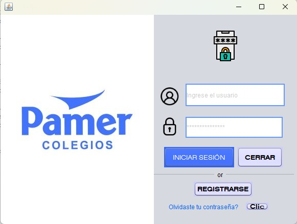

### Registro de Usuarios
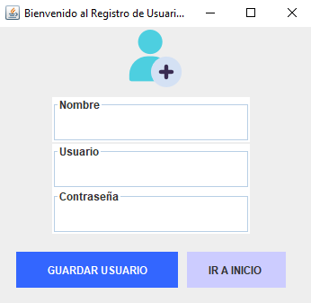

### Menú Principal
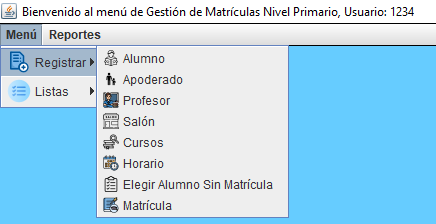

## 📷 Más Capturas
Explora más funcionalidades del sistema a continuación:

<details>
<summary>Gestión de Alumnos</summary>

- 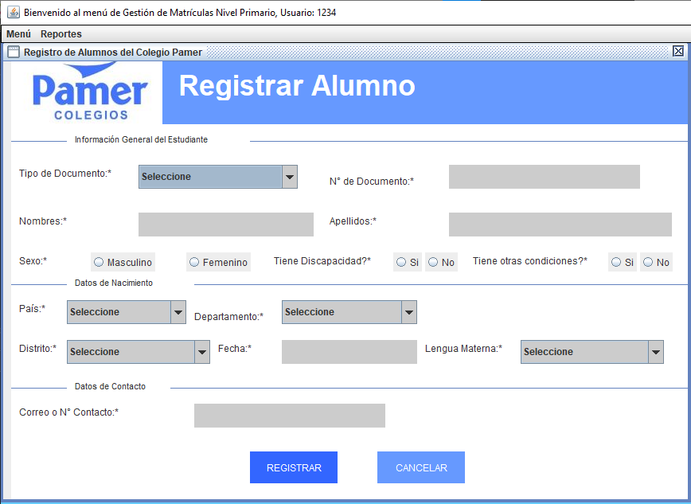
- 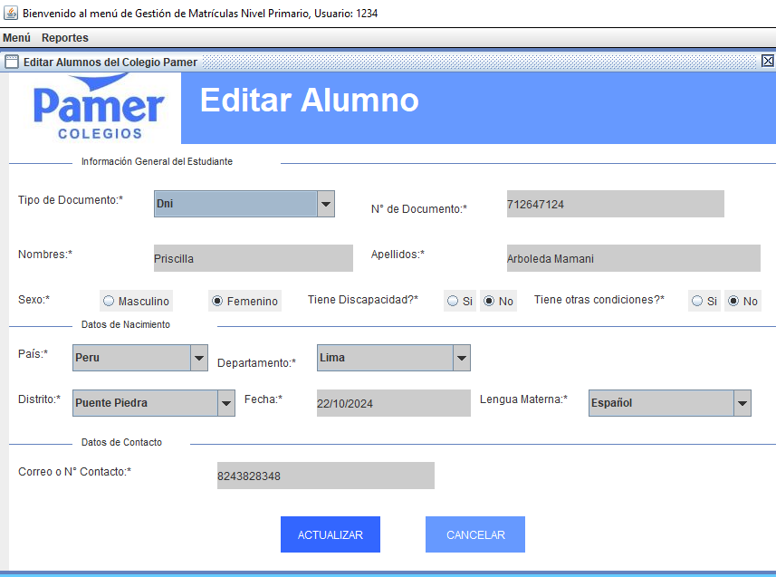
- 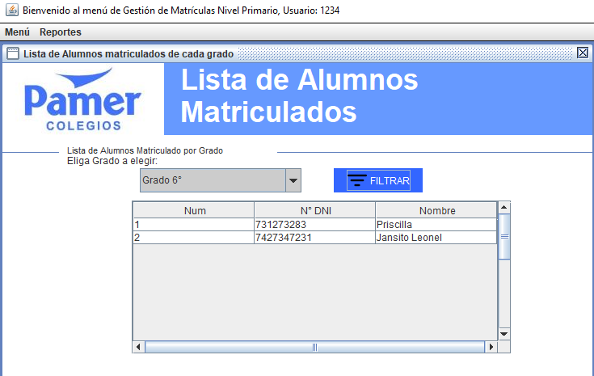
- 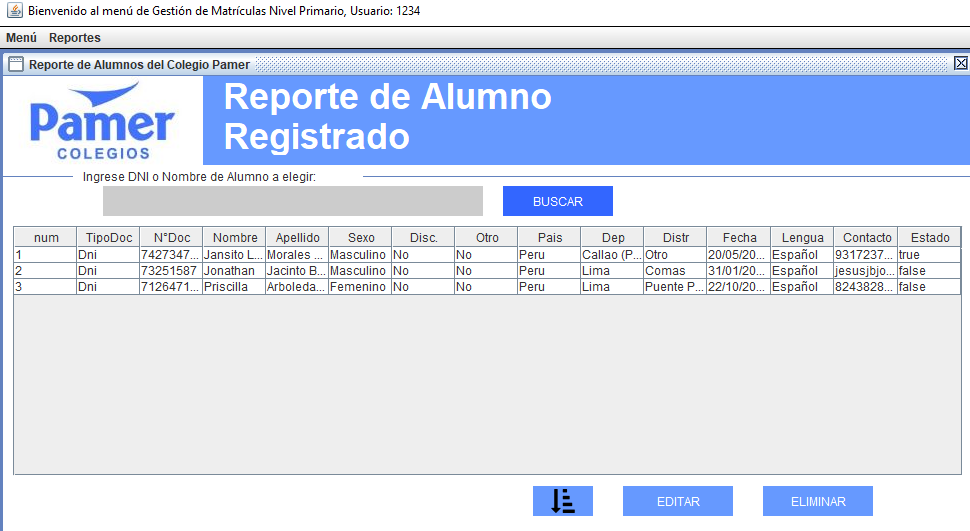

</details>

<details>
<summary>Gestión de Profesores</summary>

- 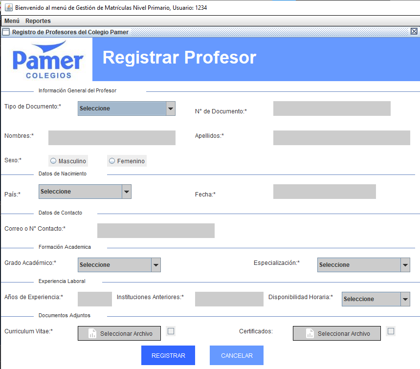
- 
- 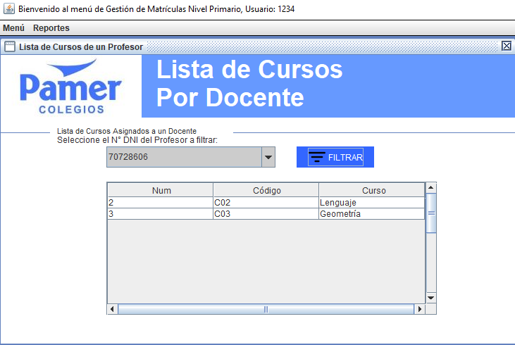
- 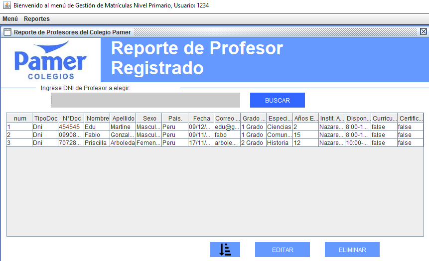

</details>

<details>
<summary>Gestión de Cursos y Horarios</summary>

- 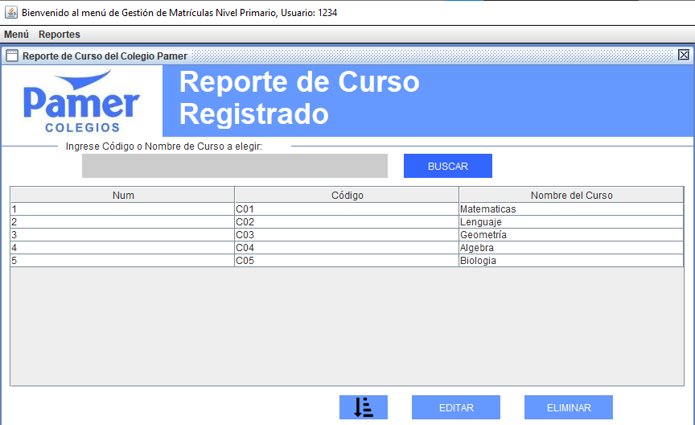
- 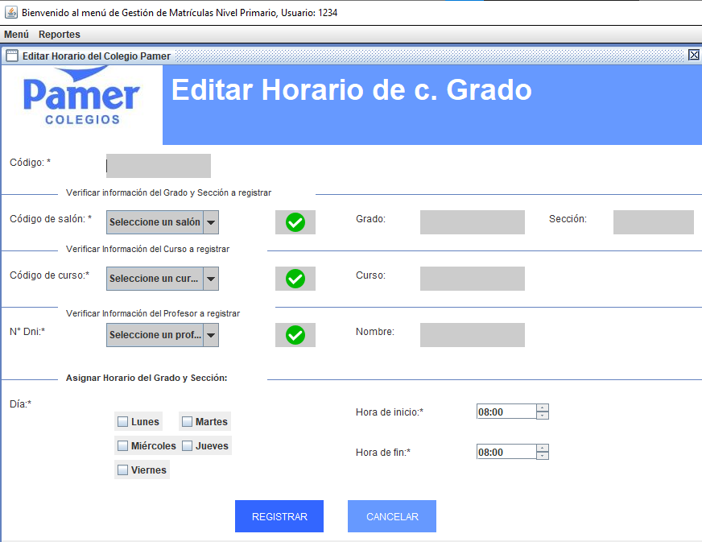
- 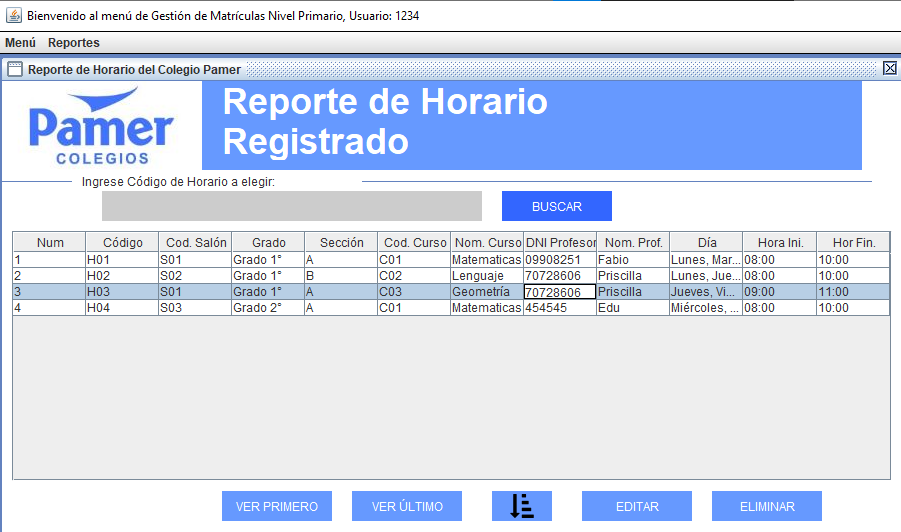

</details>

<details>
<summary>Gestión de Matrículas</summary>

- 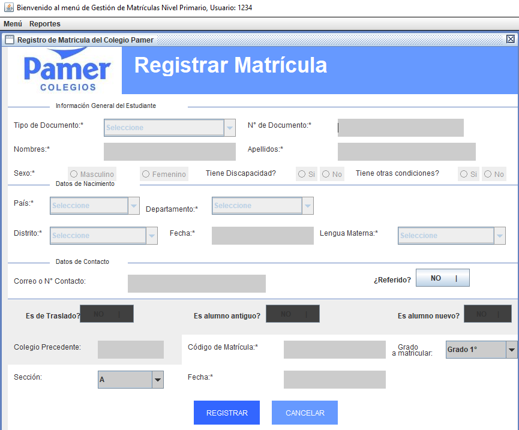
- 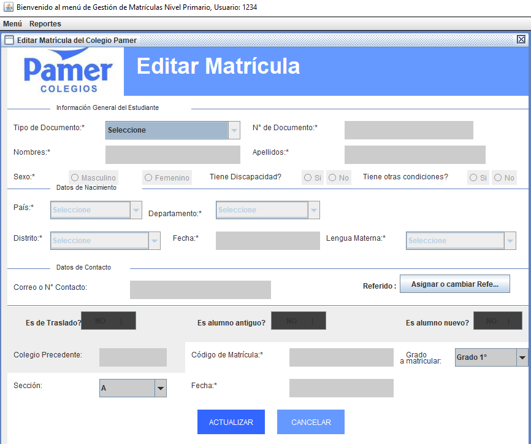
- 

</details>

<details>
<summary>Menú y Listas</summary>

- 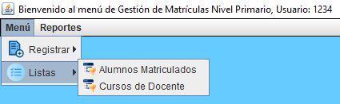
- 

</details>

Explora todas las capturas en la [carpeta de capturas](screenshots/).

---

## 📌 Características Principales
- 📋 **Gestión de Alumnos:** Registro, edición y reportes de alumnos, incluyendo matrículas y apoderados.
- 👩‍🏫 **Administración de Profesores:** Gestión de profesores y asignación de cursos.
- 📅 **Horarios y Cursos:** Creación y edición de horarios y cursos, con reportes asociados.
- 🏫 **Salones:** Administración de salones mediante listas doblemente enlazadas.
- 📊 **Reportes:** Generación de reportes para alumnos, apoderados, cursos, profesores y matrículas.
- 🔒 **Autenticación:** Sistema de login y gestión de contraseñas para usuarios.

---

## 🛠 Tecnologías Utilizadas
- 🔹 **Lenguaje:** Java 20  
- 🔹 **IDE recomendado:** NetBeans / IntelliJ IDEA  
- 🔹 **Gestor de Dependencias:** Maven  
- 🔹 **Persistencia:** Archivos binarios (`.bin`) con estructuras de datos  
- 🔹 **Interfaz Gráfica:** Swing con NetBeans GUI Builder (archivos `.form`)  
- 🔹 **Estructuras de Datos:** ArrayList, Arreglos, Colas, Listas (Simple, Doble, Circular), Pilas, Árboles  
- 🔹 **Arquitectura:** Patrón MVC  

---

## 📥 Instalación y Configuración

### 1️⃣ Clonar el Repositorio
```bash
git clone https://github.com/jonathanjesus03/ProyectoColegio.git
cd ProyectoColegio
```

### 2️⃣ Importar en tu IDE
- Abre NetBeans o IntelliJ IDEA.
- Importa el proyecto como un proyecto Maven.
- Asegúrate de tener JDK 20 instalado.

### 3️⃣ Compilar y Ejecutar
```bash
mvn clean install
mvn exec:java -Dexec.mainClass="Principal.NewMain"
```

---

## 📋 Persistencia

El proyecto utiliza archivos binarios (.bin) para almacenar datos, ubicados en la raíz del proyecto:

- Alumnos: `DatosRegistroAlumnos.bin`
- Apoderados: `DatosRegistroApoderados.bin`
- Cursos: `DatosRegistroCurso.bin`
- Horarios: `DatosRegistroHorario.bin`
- Matrículas: `DatosRegistroMatricula.bin`
- Profesores: `DatosRegistroProfesores.bin`
- Salones: `DatosRegistroSalon.bin`
- Usuarios: `DatosRegistroUsuarios.bin`
- Referidos: `DatosRegistroReferidos.bin`

Estos archivos se generan automáticamente al interactuar con el sistema, utilizando estructuras de datos implementadas en el curso.

---

## 🤝 Contribuciones
Siéntete libre de sugerir mejoras o reportar errores abriendo un issue en este repositorio.

---

## 📄 Licencia
Este proyecto está bajo la licencia MIT.
